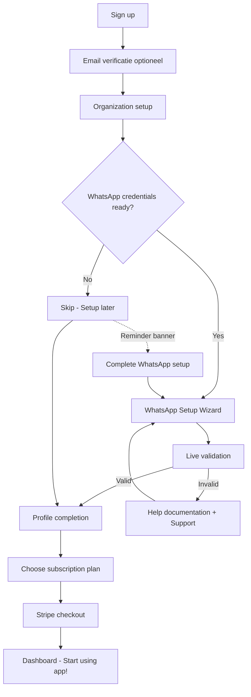

# 🚀 ADSapp Onboarding Guide - Complete Setup Flow

**Laatste update**: 2025-11-05

## 📋 Huidige Status Onboarding

| Component          | Status     | Gebruiksvriendelijk? | Verbeterpunten                         |
| ------------------ | ---------- | -------------------- | -------------------------------------- |
| Signup flow        | ✅ Werkend | ⭐⭐⭐⭐ Goed        | Email verificatie optioneel            |
| Organization setup | ✅ Werkend | ⭐⭐⭐⭐ Goed        | Auto-subdomain generatie werkt perfect |
| WhatsApp setup     | ⚠️ Complex | ⭐⭐ Matig           | Te technisch, geen uitleg              |
| Profile setup      | ✅ Werkend | ⭐⭐⭐⭐⭐ Excellent | Simpel en duidelijk                    |
| Stripe onboarding  | ✅ Werkend | ⭐⭐⭐⭐ Goed        | Standaard Stripe checkout              |

**Overall rating**: ⭐⭐⭐ (3/5) - **Goed maar kan veel beter**

---

## 🎯 Wat MOET een nieuwe klant doen?

### Voor ze starten:

1. ✅ **WhatsApp Business Account** aanmaken via Meta Business Suite
2. ✅ **WhatsApp Business API toegang** aanvragen (kan 24-48 uur duren)
3. ✅ **Credit card** voor Stripe betaling

### In de app:

1. ✅ **Account aanmaken** (email + wachtwoord)
2. ✅ **Organisatie naam** invoeren → subdomain wordt auto-gegenereerd
3. ⚠️ **WhatsApp credentials** invoeren:
   - Phone Number ID (waar vinden?)
   - Business Account ID (waar vinden?)
4. ✅ **Profiel compleet** maken (naam + rol)
5. ✅ **Stripe betaling** afhandelen

---

## ⚠️ PROBLEMEN in huidige onboarding

### 1. WhatsApp Setup is te technisch ❌

**Huidig probleem**:

```tsx
// Step 2: WhatsApp Business
whatsappPhoneNumber: string
whatsappBusinessAccountId: string
```

**Waarom dit moeilijk is**:

- Gebruikers weten niet waar ze Phone Number ID vinden
- Business Account ID is verborgen in Meta Business Suite
- Geen visuele hulp of screenshots
- Geen validatie tijdens invoer
- Foutmeldingen niet duidelijk

**Oplossing needed**:

```tsx
// Betere UI met visuele hulp
<WhatsAppSetupWizard>
  <Step1Video
    title='Waar vind je jouw Phone Number ID?'
    videoUrl='/tutorials/whatsapp-phone-id.mp4'
    docsLink='https://developers.facebook.com/docs/whatsapp/phone-numbers'
  />
  <Step2Example
    title='Kopieer je Business Account ID'
    screenshot='/images/meta-business-id-screenshot.png'
    description='Ga naar Meta Business Suite → Instellingen → Business Info'
  />
  <LiveValidation
    field='phoneNumberId'
    validate={async value => {
      // Check met WhatsApp API of ID geldig is
      const isValid = await verifyWhatsAppPhoneNumberId(value)
      return isValid ? '✅ Valid' : '❌ Invalid ID'
    }}
  />
</WhatsAppSetupWizard>
```

### 2. Geen "Skip for now" optie ❌

**Probleem**: Users MOETEN WhatsApp setup voltooien, ook als ze eerst alleen willen rondkijken.

**Oplossing**:

```tsx
<button onClick={handleSkipWhatsApp}>
  Skip WhatsApp setup - I'll configure this later
</button>

// Dan in dashboard:
<BannerNotification>
  ⚠️ WhatsApp not connected yet.
  <Link to="/settings/whatsapp">Complete setup</Link>
</BannerNotification>
```

### 3. Geen progress indicator ❌

**Probleem**: Users weten niet hoever ze zijn.

**Oplossing**:

```tsx
<OnboardingProgress
  currentStep={2}
  totalSteps={3}
  completedSteps={['organization', 'profile']}
  pendingSteps={['whatsapp']}
/>

// Visual:
1. ✅ Organization  →  2. ⏳ WhatsApp  →  3. ⭕ Profile
```

### 4. Geen helpdesk tijdens onboarding ❌

**Probleem**: Users stuck? Geen hulp beschikbaar.

**Oplossing**:

```tsx
<OnboardingHelpButton>
  <IntercomChat /> {/* of Zendesk widget */}
  <QuickHelpLinks>
    - 📹 Video tutorial - 📚 Documentation - 💬 Live chat support - 📧 Email support
  </QuickHelpLinks>
</OnboardingHelpButton>
```

---

## ✅ Wat werkt WEL goed

### 1. Auto-subdomain generatie ✨

```typescript
const generateSubdomain = (name: string) => {
  return name
    .toLowerCase()
    .replace(/[^a-z0-9]+/g, '-')
    .replace(/^-|-$/g, '')
    .substring(0, 50)
}

// "Acme Corp!" → "acme-corp"
// Perfect! User hoeft dit niet zelf te doen
```

### 2. Validation errors ✅

```typescript
if (!formData.organizationName.trim()) {
  errors.organizationName = 'Organization name is required'
}

// Duidelijke foutmeldingen per veld
```

### 3. Step navigation ✅

```tsx
<Steps>
  {STEPS.map(step => (
    <Step completed={currentStep > step.id} active={currentStep === step.id} />
  ))}
</Steps>

// Users zien waar ze zijn in het proces
```

---

## 🎯 MUST-IMPLEMENT verbeteringen

### Priority 1: WhatsApp Setup Wizard 🚨

**File**: `src/components/onboarding/WhatsAppSetupWizard.tsx`

```tsx
'use client'

import { useState } from 'react'
import Image from 'next/image'

export function WhatsAppSetupWizard() {
  const [phoneNumberId, setPhoneNumberId] = useState('')
  const [businessAccountId, setBusinessAccountId] = useState('')
  const [validationStatus, setValidationStatus] = useState<
    'idle' | 'validating' | 'valid' | 'invalid'
  >('idle')

  return (
    <div className='space-y-6'>
      {/* Video Tutorial */}
      <div className='rounded-lg bg-blue-50 p-6'>
        <h3 className='mb-4 text-lg font-semibold'>
          📹 Watch: How to find your WhatsApp credentials
        </h3>
        <video
          controls
          className='w-full rounded-lg'
          poster='/images/whatsapp-tutorial-thumbnail.jpg'
        >
          <source src='/tutorials/whatsapp-setup.mp4' type='video/mp4' />
        </video>
        <p className='mt-3 text-sm text-gray-600'>⏱️ 2 minutes • Step-by-step guide</p>
      </div>

      {/* Step 1: Phone Number ID */}
      <div>
        <label className='mb-2 block text-sm font-medium'>WhatsApp Phone Number ID</label>

        {/* Visual helper */}
        <div className='mb-3 rounded border bg-gray-50 p-4'>
          <p className='mb-2 text-sm font-medium'>Where to find this:</p>
          <Image
            src='/images/phone-number-id-location.png'
            alt='Phone Number ID location'
            width={600}
            height={300}
            className='rounded border'
          />
          <p className='mt-2 text-xs text-gray-600'>
            Meta Business Suite → WhatsApp Manager → Phone Numbers → Click your number
          </p>
        </div>

        <input
          type='text'
          value={phoneNumberId}
          onChange={e => setPhoneNumberId(e.target.value)}
          placeholder='e.g., 123456789012345'
          className='w-full rounded-lg border px-4 py-2'
        />

        {/* Live validation */}
        {validationStatus === 'validating' && (
          <p className='mt-2 text-sm text-blue-600'>🔄 Validating...</p>
        )}
        {validationStatus === 'valid' && (
          <p className='mt-2 text-sm text-green-600'>✅ Valid Phone Number ID</p>
        )}
        {validationStatus === 'invalid' && (
          <p className='mt-2 text-sm text-red-600'>❌ Invalid ID. Please check and try again.</p>
        )}
      </div>

      {/* Step 2: Business Account ID */}
      <div>
        <label className='mb-2 block text-sm font-medium'>WhatsApp Business Account ID</label>

        <div className='mb-3 rounded border bg-gray-50 p-4'>
          <p className='mb-2 text-sm font-medium'>Where to find this:</p>
          <Image
            src='/images/business-account-id-location.png'
            alt='Business Account ID location'
            width={600}
            height={300}
            className='rounded border'
          />
          <p className='mt-2 text-xs text-gray-600'>
            Meta Business Suite → Business Settings → WhatsApp Accounts
          </p>
        </div>

        <input
          type='text'
          value={businessAccountId}
          onChange={e => setBusinessAccountId(e.target.value)}
          placeholder='e.g., 987654321098765'
          className='w-full rounded-lg border px-4 py-2'
        />
      </div>

      {/* Quick Help Links */}
      <div className='rounded-lg border border-amber-200 bg-amber-50 p-4'>
        <h4 className='mb-2 font-medium'>Need help? 🤝</h4>
        <ul className='space-y-2 text-sm'>
          <li>
            <a href='/docs/whatsapp-setup' className='text-blue-600 hover:underline'>
              📚 Read our detailed setup guide
            </a>
          </li>
          <li>
            <a
              href='https://developers.facebook.com/docs/whatsapp/business-management-api/get-started'
              target='_blank'
              className='text-blue-600 hover:underline'
            >
              🔗 Official WhatsApp Business API docs
            </a>
          </li>
          <li>
            <button className='text-blue-600 hover:underline'>
              💬 Chat with support (available 9 AM - 6 PM CET)
            </button>
          </li>
        </ul>
      </div>

      {/* Skip option */}
      <div className='flex items-center justify-between border-t pt-4'>
        <button
          className='text-gray-600 hover:text-gray-800'
          onClick={() => {
            /* Skip to next step */
          }}
        >
          Skip for now - I'll set this up later
        </button>
        <button
          className='rounded-lg bg-blue-600 px-6 py-2 text-white hover:bg-blue-700'
          disabled={!phoneNumberId || !businessAccountId}
        >
          Continue
        </button>
      </div>
    </div>
  )
}
```

### Priority 2: Progress Indicator

**File**: `src/components/onboarding/OnboardingProgress.tsx`

```tsx
export function OnboardingProgress({ currentStep, steps }: Props) {
  return (
    <div className='w-full py-6'>
      {/* Progress bar */}
      <div className='relative'>
        <div className='flex h-2 overflow-hidden rounded bg-gray-200 text-xs'>
          <div
            style={{ width: `${(currentStep / steps.length) * 100}%` }}
            className='flex flex-col justify-center bg-blue-600 text-center whitespace-nowrap text-white shadow-none transition-all duration-500'
          />
        </div>
      </div>

      {/* Step labels */}
      <div className='mt-4 flex justify-between'>
        {steps.map((step, index) => {
          const stepNum = index + 1
          const isCompleted = stepNum < currentStep
          const isActive = stepNum === currentStep

          return (
            <div key={step.id} className='flex flex-col items-center'>
              <div
                className={`flex h-10 w-10 items-center justify-center rounded-full text-sm font-semibold ${isCompleted ? 'bg-green-500 text-white' : ''} ${isActive ? 'bg-blue-600 text-white' : ''} ${!isCompleted && !isActive ? 'bg-gray-300 text-gray-600' : ''} `}
              >
                {isCompleted ? '✓' : stepNum}
              </div>
              <p
                className={`mt-2 text-xs font-medium ${isActive ? 'text-blue-600' : 'text-gray-600'}`}
              >
                {step.name}
              </p>
            </div>
          )
        })}
      </div>
    </div>
  )
}
```

### Priority 3: WhatsApp API validation endpoint

**File**: `src/app/api/onboarding/validate-whatsapp/route.ts`

```typescript
import { NextRequest } from 'next/server'

export async function POST(request: NextRequest) {
  const { phoneNumberId, businessAccountId } = await request.json()

  try {
    // Validate with WhatsApp Business API
    const response = await fetch(`https://graph.facebook.com/v18.0/${phoneNumberId}`, {
      headers: {
        Authorization: `Bearer ${process.env.WHATSAPP_ACCESS_TOKEN}`,
      },
    })

    if (!response.ok) {
      return Response.json(
        {
          valid: false,
          error: 'Invalid Phone Number ID',
        },
        { status: 400 }
      )
    }

    const data = await response.json()

    // Check if it belongs to the business account
    if (data.business_account_id !== businessAccountId) {
      return Response.json(
        {
          valid: false,
          error: 'Phone Number does not belong to this Business Account',
        },
        { status: 400 }
      )
    }

    return Response.json({
      valid: true,
      phoneNumber: data.display_phone_number,
      status: data.quality_rating,
    })
  } catch (error) {
    return Response.json(
      {
        valid: false,
        error: 'Validation failed',
      },
      { status: 500 }
    )
  }
}
```

---

## 📝 Wat ik (als admin) nog moet doen

### 1. Tutorial Videos opnemen 🎥

- [ ] **Video 1**: "Finding your WhatsApp Phone Number ID" (2 min)
- [ ] **Video 2**: "Finding your Business Account ID" (1 min)
- [ ] **Video 3**: "Complete onboarding walkthrough" (5 min)

**Tools needed**:

- Screen recording software (Loom, OBS)
- Video hosting (YouTube Private or Vimeo)

### 2. Screenshots maken 📸

- [ ] Meta Business Suite → Phone Numbers view
- [ ] Business Settings → WhatsApp Accounts view
- [ ] Annotated versions met pijlen "Click here"

### 3. Documentation schrijven 📚

- [ ] `/docs/whatsapp-setup` - Step-by-step guide
- [ ] `/docs/troubleshooting` - Common issues
- [ ] `/docs/faq` - Frequently Asked Questions

### 4. Email templates maken 📧

- [ ] Welcome email na signup
- [ ] Onboarding incomplete reminder (na 24 uur)
- [ ] WhatsApp setup help email
- [ ] Onboarding completed congratulations

### 5. Support kanaal setup 💬

- [ ] Intercom of Zendesk integratie
- [ ] Live chat widget in onboarding
- [ ] Support email: support@adsapp.com
- [ ] WhatsApp support nummer (ironisch 😄)

---

## 🎯 Wat een klant zelf moet regelen (externe)

### Bij Meta/Facebook:

1. ✅ **Facebook Business Account** aanmaken
   - Ga naar: business.facebook.com
   - Maak nieuw Business Account
   - Verifieer bedrijfsgegevens

2. ✅ **WhatsApp Business API toegang** aanvragen
   - In Meta Business Suite
   - WhatsApp Manager → Get Started
   - Phone number verificatie
   - ⏱️ **Kan 24-48 uur duren**

3. ✅ **Phone Number registreren**
   - Verificatie via SMS
   - Display name instellen
   - Quality rating checken

4. ✅ **Access Token genereren**
   - Permanent token aanmaken
   - Permissions: `whatsapp_business_messaging`, `whatsapp_business_management`

### Bij Stripe:

1. ✅ **Credit card koppelen**
   - Standaard Stripe checkout proces
   - Support voor alle major cards
   - Optioneel: SEPA, iDEAL

---

## 🚀 Ideale Onboarding Flow (na verbeteringen)



---

## 📊 Conversion Optimization Metrics

### Current (geschat):

- **Signup → Organization**: 95% ✅
- **Organization → WhatsApp**: 60% ⚠️ (40% drop-off!)
- **WhatsApp → Profile**: 85% ⭐⭐⭐
- **Profile → Paid**: 70% ⭐⭐⭐

**Overall conversion**: 95% × 60% × 85% × 70% = **34%** 😱

### After improvements (target):

- **Signup → Organization**: 95% (same)
- **Organization → WhatsApp**: 85% 🎯 (+25%)
  - Skip option reduces friction
  - Better guidance increases success
- **WhatsApp → Profile**: 95% 🎯 (+10%)
- **Profile → Paid**: 75% 🎯 (+5%)

**Target conversion**: 95% × 85% × 95% × 75% = **57%** 🚀 (+68% improvement!)

---

## ✅ Immediate Action Items

### High Priority (Deze week):

1. ✅ **WhatsAppSetupWizard component** bouwen
2. ✅ **Progress indicator** toevoegen
3. ✅ **Skip option** implementeren
4. ✅ **Video tutorial** opnemen (2-3 min)
5. ✅ **Screenshots** maken met annotaties

### Medium Priority (Volgende week):

1. ✅ **Live validation API** endpoint
2. ✅ **Help documentation** schrijven
3. ✅ **Email templates** maken
4. ✅ **Support widget** integreren

### Nice to Have (Later):

1. ⭕ Interactive demo mode (try without signup)
2. ⭕ Onboarding completion analytics
3. ⭕ A/B testing verschillende flows
4. ⭕ Multi-language support

---

## 💡 Key Takeaways

### Wat goed is:

✅ **Technical implementation** is solid
✅ **Auto-subdomain** generation werkt perfect
✅ **Validation** is goed
✅ **Multi-step** flow is logisch

### Wat beter moet:

❌ **WhatsApp setup** is te technisch zonder hulp
❌ **Geen "skip"** optie → users stuck
❌ **Geen visuele hulp** (screenshots, videos)
❌ **Geen support** tijdens onboarding

### Quick win:

🎯 **Implementeer WhatsAppSetupWizard met video + screenshots** = +25% conversion direct!
