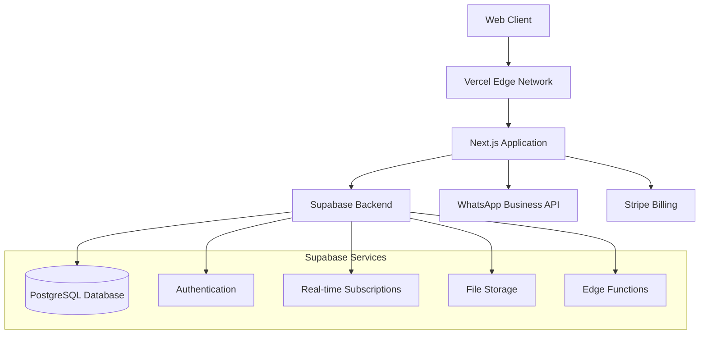

# 📋 Comprehensive Project Plan: Multi-Tenant WhatsApp Business Inbox SaaS

**Project Name:** ADSapp - Multi-Tenant WhatsApp Business Inbox SaaS
**Date Created:** September 25, 2025
**Version:** 1.0.0
**Tech Stack:** Next.js, TypeScript, Supabase, Tailwind CSS, Stripe
**Deployment:** Vercel + Supabase

---

## 📑 Table of Contents

1. [Executive Summary](#executive-summary)
2. [Feature Breakdown](#feature-breakdown)
3. [Technical Architecture](#technical-architecture)
4. [Development Phases & Milestones](#development-phases--milestones)
5. [Dependencies & Requirements](#dependencies--requirements)
6. [Risk Assessment & Mitigation](#risk-assessment--mitigation)
7. [Timeline Estimates](#timeline-estimates)
8. [Resource Requirements](#resource-requirements)
9. [Quality Assurance Strategy](#quality-assurance-strategy)
10. [Deployment Strategy](#deployment-strategy)

---

## 1. Executive Summary

### 1.1 Project Vision
Create a comprehensive multi-tenant SaaS platform that enables businesses to manage their WhatsApp communication professionally through an intuitive inbox interface, automated workflows, team collaboration features, and subscription-based billing.

### 1.2 Core Value Proposition
- **Professional WhatsApp Management**: Transform WhatsApp Business API into a powerful business tool
- **Multi-Tenant Architecture**: Secure, scalable solution for multiple business clients
- **Team Collaboration**: Enable multiple team members to manage customer conversations
- **Automation & Workflows**: Reduce response time with intelligent automation
- **Analytics & Insights**: Data-driven decision making for customer communication
- **Subscription Model**: Predictable revenue through tiered pricing

### 1.3 Success Metrics
- **Technical**: 99.9% uptime, <2s page load times, secure multi-tenancy
- **Business**: 50+ paying customers in first 6 months, <5% churn rate
- **User Experience**: <30s onboarding time, 4.5+ customer satisfaction score

---

## 2. Feature Breakdown

### 2.1 Core Features (MVP)

#### 2.1.1 Authentication & Multi-Tenancy
- **User Management**
  - User registration and login
  - Email verification
  - Password reset functionality
  - Multi-factor authentication (MFA)
- **Tenant Management**
  - Organization creation and management
  - User role management (Owner, Admin, Agent)
  - Tenant isolation and security
  - Subdomain/custom domain support

#### 2.1.2 WhatsApp Integration
- **WhatsApp Business API Integration**
  - Webhook configuration for message receiving
  - Message sending capabilities
  - Media handling (images, videos, documents)
  - WhatsApp Business verification process
- **Phone Number Management**
  - Multiple phone number support per tenant
  - Number verification and setup
  - Number status monitoring

#### 2.1.3 Inbox Management
- **Conversation Interface**
  - Real-time message synchronization
  - Conversation threading and history
  - Message status indicators (sent, delivered, read)
  - Media preview and download
  - Contact information display
- **Message Management**
  - Send text messages
  - Send media files
  - Message templates
  - Quick replies
  - Message search and filtering

#### 2.1.4 Team Collaboration
- **Assignment System**
  - Conversation assignment to team members
  - Auto-assignment rules
  - Workload distribution
- **Internal Communications**
  - Internal notes on conversations
  - @mentions and notifications
  - Team chat functionality

#### 2.1.5 Basic Automation
- **Auto-Replies**
  - Welcome messages
  - Out-of-office responses
  - Keyword-based auto-responses
- **Basic Workflows**
  - Simple if-then automation rules
  - Escalation workflows
  - Tag-based automation

### 2.2 Advanced Features (Phase 2)

#### 2.2.1 Advanced Analytics
- **Conversation Analytics**
  - Response time metrics
  - Conversation volume trends
  - Customer satisfaction scores
  - Agent performance metrics
- **Business Intelligence**
  - Custom reporting
  - Data export functionality
  - Integration with analytics tools
  - ROI tracking

#### 2.2.2 Advanced Automation
- **AI-Powered Features**
  - Sentiment analysis
  - Auto-categorization
  - Smart reply suggestions
  - Chatbot integration
- **Complex Workflows**
  - Multi-step automation
  - API integrations
  - CRM synchronization
  - E-commerce integrations

#### 2.2.3 Advanced Integration
- **CRM Integration**
  - Salesforce integration
  - HubSpot integration
  - Custom CRM connections
- **E-commerce Integration**
  - Shopify integration
  - WooCommerce integration
  - Order tracking and updates

### 2.3 Enterprise Features (Phase 3)

#### 2.3.1 Enterprise Security
- **Advanced Security**
  - SSO integration (SAML, OAuth)
  - Advanced audit logging
  - IP whitelisting
  - Data encryption at rest
- **Compliance**
  - GDPR compliance tools
  - Data retention policies
  - Export/delete customer data
  - Privacy controls

#### 2.3.2 Scale & Performance
- **High Availability**
  - Multi-region deployment
  - Load balancing
  - Failover mechanisms
  - Performance optimization
- **Advanced Customization**
  - Custom branding
  - API access for integrations
  - Webhook configurations
  - Custom fields and metadata

---

## 3. Technical Architecture

### 3.1 Architecture Overview



### 3.2 Database Schema Design

#### 3.2.1 Core Tables
```sql
-- Organizations (Tenants)
CREATE TABLE organizations (
    id UUID PRIMARY KEY DEFAULT gen_random_uuid(),
    name VARCHAR(255) NOT NULL,
    slug VARCHAR(100) UNIQUE NOT NULL,
    domain VARCHAR(255),
    settings JSONB DEFAULT '{}',
    created_at TIMESTAMP DEFAULT NOW(),
    updated_at TIMESTAMP DEFAULT NOW()
);

-- Users
CREATE TABLE users (
    id UUID PRIMARY KEY DEFAULT gen_random_uuid(),
    email VARCHAR(255) UNIQUE NOT NULL,
    password_hash VARCHAR(255),
    first_name VARCHAR(100),
    last_name VARCHAR(100),
    avatar_url VARCHAR(500),
    created_at TIMESTAMP DEFAULT NOW(),
    updated_at TIMESTAMP DEFAULT NOW()
);

-- Organization Members
CREATE TABLE organization_members (
    id UUID PRIMARY KEY DEFAULT gen_random_uuid(),
    organization_id UUID REFERENCES organizations(id) ON DELETE CASCADE,
    user_id UUID REFERENCES users(id) ON DELETE CASCADE,
    role VARCHAR(50) DEFAULT 'agent',
    permissions JSONB DEFAULT '{}',
    joined_at TIMESTAMP DEFAULT NOW(),
    UNIQUE(organization_id, user_id)
);

-- WhatsApp Phone Numbers
CREATE TABLE whatsapp_numbers (
    id UUID PRIMARY KEY DEFAULT gen_random_uuid(),
    organization_id UUID REFERENCES organizations(id) ON DELETE CASCADE,
    phone_number VARCHAR(20) UNIQUE NOT NULL,
    display_name VARCHAR(255),
    business_account_id VARCHAR(255),
    is_verified BOOLEAN DEFAULT FALSE,
    webhook_url VARCHAR(500),
    access_token_encrypted TEXT,
    created_at TIMESTAMP DEFAULT NOW(),
    updated_at TIMESTAMP DEFAULT NOW()
);

-- Contacts
CREATE TABLE contacts (
    id UUID PRIMARY KEY DEFAULT gen_random_uuid(),
    organization_id UUID REFERENCES organizations(id) ON DELETE CASCADE,
    phone_number VARCHAR(20) NOT NULL,
    name VARCHAR(255),
    avatar_url VARCHAR(500),
    metadata JSONB DEFAULT '{}',
    created_at TIMESTAMP DEFAULT NOW(),
    updated_at TIMESTAMP DEFAULT NOW(),
    UNIQUE(organization_id, phone_number)
);

-- Conversations
CREATE TABLE conversations (
    id UUID PRIMARY KEY DEFAULT gen_random_uuid(),
    organization_id UUID REFERENCES organizations(id) ON DELETE CASCADE,
    whatsapp_number_id UUID REFERENCES whatsapp_numbers(id) ON DELETE CASCADE,
    contact_id UUID REFERENCES contacts(id) ON DELETE CASCADE,
    assigned_to UUID REFERENCES users(id),
    status VARCHAR(50) DEFAULT 'open',
    priority VARCHAR(50) DEFAULT 'normal',
    tags TEXT[],
    metadata JSONB DEFAULT '{}',
    last_message_at TIMESTAMP,
    created_at TIMESTAMP DEFAULT NOW(),
    updated_at TIMESTAMP DEFAULT NOW()
);

-- Messages
CREATE TABLE messages (
    id UUID PRIMARY KEY DEFAULT gen_random_uuid(),
    conversation_id UUID REFERENCES conversations(id) ON DELETE CASCADE,
    whatsapp_message_id VARCHAR(255),
    sender_type VARCHAR(50) NOT NULL, -- 'contact' or 'agent'
    sender_id UUID, -- contact_id or user_id
    content TEXT,
    message_type VARCHAR(50) DEFAULT 'text',
    media_url VARCHAR(500),
    media_type VARCHAR(100),
    status VARCHAR(50) DEFAULT 'sent',
    metadata JSONB DEFAULT '{}',
    created_at TIMESTAMP DEFAULT NOW()
);

-- Subscriptions
CREATE TABLE subscriptions (
    id UUID PRIMARY KEY DEFAULT gen_random_uuid(),
    organization_id UUID REFERENCES organizations(id) ON DELETE CASCADE,
    stripe_subscription_id VARCHAR(255) UNIQUE,
    stripe_customer_id VARCHAR(255),
    plan_id VARCHAR(255) NOT NULL,
    status VARCHAR(50) DEFAULT 'active',
    current_period_start TIMESTAMP,
    current_period_end TIMESTAMP,
    created_at TIMESTAMP DEFAULT NOW(),
    updated_at TIMESTAMP DEFAULT NOW()
);
```

### 3.3 API Architecture

#### 3.3.1 API Routes Structure
```
/api
├── auth/
│   ├── login
│   ├── logout
│   ├── register
│   └── reset-password
├── organizations/
│   ├── [orgId]/
│   │   ├── members
│   │   ├── settings
│   │   ├── whatsapp-numbers
│   │   └── analytics
├── conversations/
│   ├── [conversationId]/
│   │   ├── messages
│   │   ├── assign
│   │   └── notes
├── whatsapp/
│   ├── webhook
│   ├── send-message
│   └── media
├── billing/
│   ├── subscription
│   ├── plans
│   └── invoices
└── integrations/
    ├── crm
    └── analytics
```

### 3.4 Security Architecture

#### 3.4.1 Multi-Tenant Security
- **Row Level Security (RLS)**: Implemented in Supabase for tenant isolation
- **Organization Context**: Every request validated against user's organization
- **Role-Based Access Control**: Fine-grained permissions per organization
- **API Rate Limiting**: Per-tenant rate limiting to prevent abuse

#### 3.4.2 Data Protection
- **Encryption**: Sensitive data encrypted at rest and in transit
- **Access Tokens**: WhatsApp API tokens encrypted in database
- **Audit Logging**: All sensitive operations logged
- **GDPR Compliance**: Data export/deletion capabilities

---

## 4. Development Phases & Milestones

### 4.1 Phase 1: Foundation & MVP (Weeks 1-12)

#### Sprint 1-2: Project Setup & Authentication (Weeks 1-4)
**Milestone 1.1: Development Environment Ready**
- [x] Next.js project initialization with TypeScript
- [x] Supabase project setup and configuration
- [x] Database schema design and implementation
- [x] Authentication system with Supabase Auth
- [x] Basic user management and organization creation
- [x] Multi-tenant middleware implementation

#### Sprint 3-4: WhatsApp Integration Core (Weeks 5-8)
**Milestone 1.2: WhatsApp Connection Established**
- [ ] WhatsApp Business API integration
- [ ] Webhook handling for incoming messages
- [ ] Message sending functionality
- [ ] Phone number verification and management
- [ ] Basic message storage and retrieval

#### Sprint 5-6: Inbox Interface (Weeks 9-12)
**Milestone 1.3: Functional Inbox**
- [ ] Real-time conversation interface
- [ ] Message thread display and interaction
- [ ] Contact management system
- [ ] Basic conversation assignment
- [ ] File upload and media handling

### 4.2 Phase 2: Core Features & Team Collaboration (Weeks 13-20)

#### Sprint 7-8: Team Features (Weeks 13-16)
**Milestone 2.1: Team Collaboration Ready**
- [ ] Role-based access control
- [ ] Team member invitation system
- [ ] Conversation assignment workflows
- [ ] Internal notes and @mentions
- [ ] Basic notification system

#### Sprint 9-10: Automation & Billing (Weeks 17-20)
**Milestone 2.2: Business Features Complete**
- [ ] Basic automation rules (auto-replies, workflows)
- [ ] Stripe integration for subscription billing
- [ ] Subscription plans and pricing tiers
- [ ] Usage tracking and billing
- [ ] Basic analytics dashboard

### 4.3 Phase 3: Advanced Features & Polish (Weeks 21-28)

#### Sprint 11-12: Advanced Automation (Weeks 21-24)
**Milestone 3.1: Smart Automation**
- [ ] AI-powered message categorization
- [ ] Advanced workflow builder
- [ ] Integration with external APIs
- [ ] Chatbot integration capabilities

#### Sprint 13-14: Analytics & Performance (Weeks 25-28)
**Milestone 3.2: Production Ready**
- [ ] Comprehensive analytics and reporting
- [ ] Performance optimization
- [ ] Security audit and penetration testing
- [ ] Load testing and scaling preparation

### 4.4 Phase 4: Launch Preparation & Go-to-Market (Weeks 29-32)

#### Sprint 15-16: Launch Readiness (Weeks 29-32)
**Milestone 4.1: Launch Ready**
- [ ] Marketing website completion
- [ ] Documentation and help center
- [ ] Beta testing with select customers
- [ ] Production monitoring and alerting
- [ ] Launch campaign preparation

---

## 5. Dependencies & Requirements

### 5.1 External Dependencies

#### 5.1.1 Critical Services
1. **WhatsApp Business API**
   - Business verification process (can take 2-3 weeks)
   - API access approval from Meta
   - Webhook endpoint configuration
   - Phone number verification requirements

2. **Supabase Services**
   - Database hosting and management
   - Real-time subscriptions
   - Authentication services
   - File storage capabilities

3. **Stripe Integration**
   - Payment processing setup
   - Subscription management
   - Tax calculation services
   - Invoice generation

#### 5.1.2 Third-Party Integrations
1. **Email Services** (SendGrid/AWS SES)
   - Transactional email delivery
   - Email template management
   - Deliverability monitoring

2. **File Storage** (Supabase Storage/AWS S3)
   - Media file storage
   - CDN distribution
   - Backup and retention

3. **Monitoring & Analytics**
   - Error tracking (Sentry)
   - Performance monitoring (Vercel Analytics)
   - User analytics (PostHog/Mixpanel)

### 5.2 Technical Requirements

#### 5.2.1 Performance Requirements
- Page load time: <2 seconds
- API response time: <500ms (95th percentile)
- Real-time message delivery: <1 second
- Uptime: 99.9% availability
- Concurrent users: Support 1000+ simultaneous users

#### 5.2.2 Security Requirements
- SOC 2 Type II compliance preparation
- GDPR compliance implementation
- Data encryption at rest and in transit
- Regular security audits and penetration testing
- Multi-factor authentication support

#### 5.2.3 Scalability Requirements
- Horizontal scaling capability
- Multi-region deployment preparation
- Database optimization for high throughput
- CDN implementation for global performance

---

## 6. Risk Assessment & Mitigation

### 6.1 High-Risk Items

#### 6.1.1 WhatsApp API Dependency
**Risk**: Changes to WhatsApp Business API or policy violations
**Impact**: High - Core functionality dependent on external API
**Probability**: Medium
**Mitigation Strategies**:
- Maintain strict compliance with WhatsApp policies
- Implement comprehensive error handling and fallbacks
- Regular monitoring of API changes and deprecations
- Maintain direct relationship with WhatsApp support
- Consider alternative messaging platforms as backup

#### 6.1.2 Multi-Tenant Data Isolation
**Risk**: Data leakage between tenants
**Impact**: Critical - Legal and reputation damage
**Probability**: Low
**Mitigation Strategies**:
- Implement Row Level Security (RLS) in database
- Comprehensive testing of tenant isolation
- Regular security audits and penetration testing
- Code review focusing on data access patterns
- Automated testing for cross-tenant data access

#### 6.1.3 Scalability Bottlenecks
**Risk**: Performance degradation with increased load
**Impact**: High - User experience and churn
**Probability**: Medium
**Mitigation Strategies**:
- Performance testing from early development phases
- Database query optimization and indexing
- Implement caching strategies (Redis)
- Monitor and optimize real-time features
- Plan for horizontal scaling architecture

### 6.2 Medium-Risk Items

#### 6.2.1 Stripe Integration Complexity
**Risk**: Billing and subscription management issues
**Impact**: Medium - Revenue impact
**Probability**: Medium
**Mitigation Strategies**:
- Thorough testing of all billing scenarios
- Implement webhook handling with retry logic
- Regular reconciliation of billing data
- Clear billing documentation and support

#### 6.2.2 Team Scaling Challenges
**Risk**: Development velocity decreasing with team growth
**Impact**: Medium - Timeline delays
**Probability**: Medium
**Mitigation Strategies**:
- Implement comprehensive testing strategies
- Maintain coding standards and documentation
- Regular code reviews and knowledge sharing
- Use of AI agents for consistent code quality

### 6.3 Low-Risk Items

#### 6.3.1 Technology Stack Changes
**Risk**: Need to migrate from chosen technologies
**Impact**: Low - Well-established stack
**Probability**: Low
**Mitigation Strategies**:
- Choose mature, well-supported technologies
- Avoid vendor lock-in where possible
- Maintain abstraction layers for critical components

---

## 7. Timeline Estimates

### 7.1 Development Timeline Overview

| Phase | Duration | Start Date | End Date | Key Deliverables |
|-------|----------|------------|----------|------------------|
| Phase 1: MVP | 12 weeks | Week 1 | Week 12 | Basic WhatsApp inbox functionality |
| Phase 2: Core Features | 8 weeks | Week 13 | Week 20 | Team collaboration & billing |
| Phase 3: Advanced Features | 8 weeks | Week 21 | Week 28 | Automation & analytics |
| Phase 4: Launch Prep | 4 weeks | Week 29 | Week 32 | Marketing site & go-to-market |

### 7.2 Detailed Sprint Breakdown

#### Phase 1 Sprints (Weeks 1-12)
```
Sprint 1 (Weeks 1-2): Project Foundation
├── Project setup and tooling configuration (3 days)
├── Database schema design and implementation (4 days)
├── Basic authentication system (3 days)
└── Multi-tenant middleware (2 days)

Sprint 2 (Weeks 3-4): User Management
├── User registration and login (3 days)
├── Organization creation and management (4 days)
├── Role-based access control foundation (4 days)
└── Email verification system (2 days)

Sprint 3 (Weeks 5-6): WhatsApp Integration
├── WhatsApp Business API setup (4 days)
├── Webhook handling implementation (3 days)
├── Message receiving functionality (4 days)
└── Phone number management (2 days)

Sprint 4 (Weeks 7-8): Message Management
├── Message sending capabilities (4 days)
├── Media file handling (3 days)
├── Message status tracking (3 days)
└── Error handling and retry logic (2 days)

Sprint 5 (Weeks 9-10): Inbox Interface
├── Real-time conversation interface (5 days)
├── Message thread display (4 days)
├── Contact management UI (3 days)
└── Basic search and filtering (2 days)

Sprint 6 (Weeks 11-12): Core Polish
├── Conversation assignment system (3 days)
├── File upload and media preview (4 days)
├── Performance optimization (3 days)
└── Testing and bug fixes (3 days)
```

### 7.3 Critical Path Analysis

**Critical Dependencies**:
1. **WhatsApp API Access** (Week 1) → All messaging functionality
2. **Database Schema** (Week 1-2) → All data operations
3. **Authentication System** (Week 2-3) → All user features
4. **Real-time Infrastructure** (Week 9) → Live messaging features

**Potential Delays**:
- WhatsApp Business verification (2-3 weeks external process)
- Complex real-time synchronization debugging
- Performance optimization iterations
- Third-party integration issues

---

## 8. Resource Requirements

### 8.1 Development Team Structure

#### 8.1.1 Core Team (Minimum Viable Team)
```
Lead Developer (1 FTE)
├── Overall architecture and technical leadership
├── Complex feature implementation
├── Code review and mentoring
└── Technical decision making

Full-Stack Developer (2 FTE)
├── Feature development and implementation
├── API development and integration
├── Database design and optimization
└── Testing and debugging

Frontend Developer (1 FTE)
├── UI/UX implementation
├── Real-time interface development
├── Mobile responsiveness
└── User experience optimization

DevOps/Infrastructure (0.5 FTE)
├── Deployment automation
├── Monitoring and alerting setup
├── Performance optimization
└── Security implementation
```

#### 8.1.2 Extended Team (Optimal Team)
```
Additional Roles:
├── Product Manager (1 FTE) - Requirements and roadmap
├── UI/UX Designer (0.5 FTE) - Design and user experience
├── QA Engineer (0.5 FTE) - Testing and quality assurance
├── Technical Writer (0.25 FTE) - Documentation
└── Security Specialist (0.25 FTE) - Security audit and compliance
```

### 8.2 Technology Stack Costs

#### 8.2.1 Development Phase Costs (Monthly)
```
Supabase Pro: $25/month
├── Database hosting
├── Authentication services
├── Real-time subscriptions
└── File storage (100GB included)

Vercel Pro: $20/month per user
├── Hosting and deployment
├── Edge functions
├── Analytics
└── Preview deployments

Stripe: $0 + transaction fees
├── 2.9% + $0.30 per transaction
├── Subscription management
└── Invoice generation

Additional Services: ~$100/month
├── Error monitoring (Sentry): $26/month
├── Email service (SendGrid): $20/month
├── Domain and SSL: $15/month
└── Development tools: ~$50/month

Total Development: ~$200/month
```

#### 8.2.2 Production Scale Costs (Estimated)
```
100 Organizations, 1000 Active Users:
├── Supabase: ~$500/month
├── Vercel: ~$200/month
├── Third-party services: ~$300/month
└── Total: ~$1000/month

1000 Organizations, 10000 Active Users:
├── Supabase: ~$2000/month
├── Vercel: ~$800/month
├── Third-party services: ~$1200/month
└── Total: ~$4000/month
```

### 8.3 Hardware and Software Requirements

#### 8.3.1 Development Environment
```
Per Developer:
├── MacBook Pro/Windows PC (16GB+ RAM)
├── Development software licenses
├── Design tools (Figma Pro if needed)
├── Multiple monitors for productivity
└── High-speed internet connection
```

#### 8.3.2 External Services Budget
```
Annual Estimates:
├── WhatsApp Business API: $0 (pay per message)
├── Design assets and stock photos: $500
├── Security tools and audits: $5000
├── Legal and compliance consulting: $10000
├── Marketing and analytics tools: $3000
└── Total Annual: ~$18500
```

---

## 9. Quality Assurance Strategy

### 9.1 Testing Strategy

#### 9.1.1 Testing Pyramid
```
E2E Tests (10%)
├── Critical user journeys
├── Payment flows
├── WhatsApp integration flows
└── Multi-tenant isolation

Integration Tests (30%)
├── API endpoint testing
├── Database operations
├── Third-party integrations
└── Authentication flows

Unit Tests (60%)
├── Business logic testing
├── Utility functions
├── Component testing
└── Validation logic
```

#### 9.1.2 Testing Tools and Frameworks
```
Frontend Testing:
├── Jest - Unit testing framework
├── React Testing Library - Component testing
├── Playwright - End-to-end testing
└── Storybook - Component development and testing

Backend Testing:
├── Jest - Unit and integration testing
├── Supertest - API testing
├── Database fixtures and factories
└── Mock external services

Performance Testing:
├── Lighthouse - Web performance
├── K6 - Load testing
├── Database query analysis
└── Real-time performance monitoring
```

### 9.2 Code Quality Standards

#### 9.2.1 Code Review Process
```
Review Checklist:
├── Functionality correctness
├── Security considerations
├── Performance implications
├── Code style and formatting
├── Test coverage adequacy
├── Documentation updates
└── Multi-tenant data isolation
```

#### 9.2.2 Automated Quality Gates
```
CI/CD Pipeline Checks:
├── ESLint and Prettier formatting
├── TypeScript type checking
├── Unit test execution (>80% coverage)
├── Integration test execution
├── Security scanning (Snyk)
├── Performance budget checks
└── Build and deployment verification
```

### 9.3 Security Testing

#### 9.3.1 Security Testing Phases
```
Development Phase:
├── Static code analysis
├── Dependency vulnerability scanning
├── Authentication testing
└── Multi-tenant isolation testing

Pre-Production Phase:
├── Penetration testing
├── Security audit
├── Compliance verification
└── Load testing with security focus

Production Phase:
├── Continuous monitoring
├── Regular security scans
├── Incident response testing
└── Annual security audits
```

---

## 10. Deployment Strategy

### 10.1 Environment Strategy

#### 10.1.1 Environment Structure
```
Development
├── Local development environments
├── Feature branch deployments
├── Supabase development project
└── Test WhatsApp sandbox

Staging
├── Production-like environment
├── Integration testing
├── User acceptance testing
└── Performance testing

Production
├── Multi-region deployment (future)
├── High availability setup
├── Monitoring and alerting
└── Backup and disaster recovery
```

### 10.2 Deployment Pipeline

#### 10.2.1 CI/CD Workflow

```mermaid
graph LR
    A[Code Commit] --> B[Automated Tests]
    B --> C[Security Scan]
    C --> D[Build Application]
    D --> E[Deploy to Staging]
    E --> F[Integration Tests]
    F --> G[Manual Approval]
    G --> H[Deploy to Production]
    H --> I[Post-Deploy Verification]
    I --> J[Monitoring Alerts]
```


#### 10.2.2 Release Strategy
```
Blue-Green Deployment:
├── Maintain two identical production environments
├── Deploy to inactive environment
├── Test thoroughly before switching traffic
└── Quick rollback capability

Feature Flags:
├── Gradual feature rollout
├── A/B testing capabilities
├── Quick feature toggle
└── User-based feature access

Database Migrations:
├── Backward compatible changes
├── Automated migration scripts
├── Rollback procedures
└── Zero-downtime deployments
```

### 10.3 Monitoring and Alerting

#### 10.3.1 Application Monitoring
```
Performance Metrics:
├── Page load times
├── API response times
├── Database query performance
├── Real-time message delivery
└── Error rates and types

Business Metrics:
├── User engagement
├── Conversion rates
├── Revenue metrics
├── Customer satisfaction
└── Feature usage analytics

Infrastructure Metrics:
├── Server resource utilization
├── Database performance
├── CDN performance
├── Third-party API status
└── Security events
```

#### 10.3.2 Alerting Strategy
```
Critical Alerts (Immediate Response):
├── Application downtime
├── Database connectivity issues
├── Payment processing failures
├── Security breaches
└── Data integrity issues

Warning Alerts (4-hour Response):
├── Performance degradation
├── High error rates
├── Resource utilization spikes
├── Third-party API issues
└── User experience problems

Info Alerts (24-hour Response):
├── Deployment notifications
├── Usage milestone alerts
├── Scheduled maintenance
├── Analytics insights
└── Feature adoption metrics
```

---

## 📊 Summary and Next Steps

### Immediate Actions Required

1. **Finalize PRD Documentation**
   - Complete the placeholder PRD content
   - Define specific feature requirements
   - Establish success metrics and KPIs

2. **Setup Development Environment**
   - Initialize Next.js project with TypeScript
   - Configure Supabase project and database
   - Set up development tooling and CI/CD

3. **WhatsApp Business API Setup**
   - Begin business verification process
   - Apply for API access
   - Set up test environment

4. **Team Assembly**
   - Recruit or assign development team members
   - Define roles and responsibilities
   - Establish development workflows

### Success Factors

1. **Focus on MVP**: Prioritize core functionality over advanced features
2. **Security First**: Implement multi-tenant security from day one
3. **Performance**: Optimize for real-time messaging performance
4. **User Experience**: Design for ease of use and quick onboarding
5. **Scalability**: Build with growth in mind

### Risk Mitigation Priority

1. **WhatsApp API Dependency**: Establish backup communication channels
2. **Multi-Tenant Security**: Implement and test thoroughly
3. **Performance at Scale**: Plan for optimization from the start
4. **Team Coordination**: Use AI agents and clear processes

This comprehensive project plan provides a roadmap for building a successful Multi-Tenant WhatsApp Business Inbox SaaS platform. Regular review and adaptation of this plan will be essential as the project progresses and requirements evolve.

---

*Project Plan Version 1.0.0 - Created on September 25, 2025*