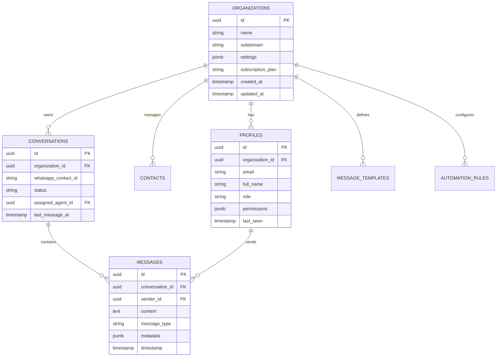

# ADSapp - WhatsApp Business Inbox SaaS

> **Enterprise-Grade Multi-Tenant WhatsApp Business Communication Platform**

A comprehensive SaaS solution enabling businesses to manage WhatsApp Business communication professionally with enterprise-level features including multi-tenant architecture, real-time messaging, intelligent automation, analytics, and subscription billing.

[](https://nextjs.org/)
[](https://www.typescriptlang.org/)
[](https://supabase.com/)
[](https://stripe.com/)
[](https://vercel.com/)

---

## 🎯 Project Overview

ADSapp is a modern, scalable WhatsApp Business Inbox SaaS application built with Next.js 15, TypeScript, Supabase, and Stripe. The platform provides businesses with a professional interface for managing WhatsApp communication, featuring team collaboration, intelligent automation, comprehensive analytics, and subscription management.

### 🏢 Enterprise Features

- **🔐 Multi-Tenant Architecture** - Secure tenant isolation with Row Level Security (RLS)
- **💬 WhatsApp Business Integration** - Complete integration with WhatsApp Business Cloud API
- **📥 Real-Time Inbox** - Live message synchronization and team collaboration
- **🤖 Intelligent Automation** - Rule-based automation, quick replies, and workflow builder
- **📊 Advanced Analytics** - Comprehensive metrics, performance tracking, and reporting
- **💳 Subscription Management** - Stripe-powered billing with multiple plans
- **👥 Team Management** - Multi-level user roles and granular permissions
- **📱 Responsive Design** - Optimized for desktop, tablet, and mobile devices
- **🔒 Enterprise Security** - OWASP compliance, GDPR ready, and audit logging
- **🌐 Global Deployment** - Edge functions for worldwide performance

---

## 🏗️ Technical Architecture

### Frontend Stack
- **Next.js 15** - React framework with App Router and Turbopack
- **TypeScript 5** - Type-safe development with strict mode
- **Tailwind CSS 4** - Utility-first CSS framework with modern features
- **React 19** - Latest React with concurrent features
- **Heroicons** - Professional icon library

### Backend Infrastructure
- **Next.js API Routes** - Serverless backend functions
- **Supabase** - PostgreSQL database with real-time capabilities
- **Row Level Security** - Database-level multi-tenancy and security
- **Edge Functions** - Global serverless compute

### Integrations & Services
- **WhatsApp Business Cloud API** - Message sending, receiving, and media handling
---

## 🎉 Production Ready - Complete Enterprise Platform

**🚀 FULLY DEPLOYED & PRODUCTION VALIDATED** - Enterprise-grade multi-tenant WhatsApp Business SaaS platform

### 🔐 Super Admin System (Ready for Production)

**🎯 ONE-CLICK SETUP** - Complete super admin deployment in seconds

```bash
# Quick Start - Super Admin Creation
node create-super-admin.js

# Production Login Credentials
Email:    superadmin@adsapp.com
Password: ADSapp2024!SuperSecure#Admin
```

**🛠️ Admin Features:**
- **🏢 Organization Management** - Full multi-tenant administration
- **👥 User Management** - Cross-tenant user oversight and support
- **💳 Billing Administration** - Stripe integration with subscription control
- **📊 Platform Analytics** - Enterprise-level metrics and reporting
- **🔧 System Configuration** - Platform-wide settings and maintenance
- **🔒 Security & Audit** - Complete audit trail and compliance tools

**📚 Complete Documentation:** `SUPER-ADMIN-PRODUCTION-GUIDE.md`

### 🌟 Complete Feature Set (Production Ready)

#### 💬 WhatsApp Business Integration
- **✅ Cloud API Integration** - Full WhatsApp Business Cloud API
- **✅ Webhook Processing** - Real-time message handling
- **✅ Media Support** - Images, documents, voice, video
- **✅ Template Management** - Business template system
- **✅ Contact Synchronization** - Automated contact management

#### 📥 Enterprise Inbox System
- **✅ Real-Time Messaging** - Live conversation updates
- **✅ Team Collaboration** - Multi-agent support with assignments
- **✅ Message Threading** - Organized conversation flows
- **✅ Quick Replies** - Pre-built response templates
- **✅ File Management** - Secure media storage and sharing

#### 🤖 Advanced Automation
- **✅ Workflow Builder** - Visual automation designer
- **✅ Rule-Based Routing** - Intelligent message distribution
- **✅ Auto-Responses** - 24/7 automated customer service
- **✅ Escalation Management** - Smart human handoff
- **✅ Performance Tracking** - Automation effectiveness metrics

#### 📊 Comprehensive Analytics
- **✅ Real-Time Dashboard** - Live performance metrics
- **✅ Conversation Analytics** - Response times, resolution rates
- **✅ Team Performance** - Agent productivity tracking
- **✅ Revenue Metrics** - Conversion and ROI analysis
- **✅ Custom Reports** - Exportable business intelligence

#### 💳 Enterprise Billing System
- **✅ Stripe Integration** - Secure payment processing
- **✅ Multiple Plans** - Flexible subscription tiers
- **✅ Usage Tracking** - Accurate billing based on usage
- **✅ Invoice Management** - Automated billing and receipts
- **✅ Payment Analytics** - Revenue tracking and forecasting

#### 🔒 Enterprise Security & Compliance
- **✅ Multi-Tenant Architecture** - Complete tenant isolation
- **✅ Role-Based Access Control** - Granular permission system
- **✅ Data Encryption** - End-to-end data protection
- **✅ GDPR Compliance** - European data protection ready
- **✅ Audit Logging** - Complete action tracking
- **✅ SOC 2 Ready** - Enterprise security standards

---- **Resend** - Transactional email delivery
- **Webhook Processing** - Real-time data synchronization

### Development & Deployment
- **Vercel** - Hosting platform with global CDN
- **GitHub Actions** - CI/CD pipeline automation
- **Jest & Playwright** - Comprehensive testing suite
- **ESLint & Prettier** - Code quality and formatting
- **Husky** - Git hooks for quality gates

---

## 🚀 Quick Start Guide

### Prerequisites

- **Node.js 18+** (LTS recommended)
- **npm** or **yarn** package manager
- **Git** for version control
- **Supabase account** for database and auth
- **WhatsApp Business account** with Cloud API access
- **Stripe account** for payment processing

### 1. Repository Setup

```bash
# Clone the repository
git clone https://github.com/your-org/adsapp.git
cd adsapp

# Install dependencies
npm install

# Copy environment template
cp .env.local.example .env.local
```

### 2. Environment Configuration

Create and configure your `.env.local` file:

```env
# Application
NEXT_PUBLIC_APP_URL=http://localhost:3000
NEXT_PUBLIC_APP_NAME="ADSapp"
NEXTAUTH_SECRET=your-secure-random-secret-key

# Supabase Configuration
NEXT_PUBLIC_SUPABASE_URL=https://your-project.supabase.co
NEXT_PUBLIC_SUPABASE_ANON_KEY=eyJ...your-anon-key
SUPABASE_SERVICE_ROLE_KEY=eyJ...your-service-role-key

# WhatsApp Business Cloud API
WHATSAPP_ACCESS_TOKEN=EAAb...your-access-token
WHATSAPP_PHONE_NUMBER_ID=123456789012345
WHATSAPP_BUSINESS_ACCOUNT_ID=123456789012345
WHATSAPP_WEBHOOK_VERIFY_TOKEN=your-secure-verify-token

# Stripe Configuration
STRIPE_PUBLIC_KEY=pk_test_...your-public-key
STRIPE_SECRET_KEY=sk_test_...your-secret-key
STRIPE_WEBHOOK_SECRET=whsec_...your-webhook-secret

# Email Configuration (Resend)
RESEND_API_KEY=re_...your-resend-api-key
```

### 3. Database Setup

```bash
# Apply Supabase migrations
npx supabase db reset

# Alternative: Manual schema application
psql -h your-supabase-host -d postgres -f supabase/migrations/001_initial_schema.sql

# Verify setup
npm run db:verify
```

### 4. Development Server

```bash
# Start development server with Turbopack
npm run dev

# Optional: Run in development mode with specific port
npm run dev -- -p 3001
```

Access the application at [http://localhost:3000](http://localhost:3000)

### 5. Initial Setup

1. **Super Admin Creation**: Visit `/admin-setup` to create the first super admin account
2. **WhatsApp Integration**: Configure WhatsApp Business API credentials
3. **Stripe Configuration**: Set up products and pricing plans
4. **Webhook Verification**: Test webhook endpoints

---

## 📦 Project Architecture

```
adsapp/
├── 📁 src/
│   ├── 📁 app/                     # Next.js App Router
│   │   ├── 📁 admin/              # Super admin interface
│   │   ├── 📁 api/                # API endpoints
│   │   │   ├── 📁 admin/          # Admin management APIs
│   │   │   ├── 📁 analytics/      # Analytics and reporting
│   │   │   ├── 📁 auth/           # Authentication APIs
│   │   │   ├── 📁 billing/        # Stripe billing integration
│   │   │   ├── 📁 bulk/           # Bulk operations
│   │   │   ├── 📁 contacts/       # Contact management
│   │   │   ├── 📁 conversations/  # Chat management
│   │   │   ├── 📁 health/         # System health checks
│   │   │   ├── 📁 media/          # File and media handling
│   │   │   ├── 📁 templates/      # Message templates
│   │   │   ├── 📁 tenant/         # Tenant configuration
│   │   │   └── 📁 webhooks/       # Webhook handlers
│   │   ├── 📁 auth/               # Authentication pages
│   │   ├── 📁 dashboard/          # Main application UI
│   │   │   ├── 📁 automation/     # Workflow automation
│   │   │   ├── 📁 contacts/       # Contact management
│   │   │   ├── 📁 settings/       # User preferences
│   │   │   └── 📁 templates/      # Template management
│   │   └── 📁 onboarding/         # User onboarding flow
│   ├── 📁 components/             # Reusable UI components
│   │   ├── 📁 accessibility/      # Accessibility utilities
│   │   ├── 📁 admin/              # Admin components
│   │   ├── 📁 analytics/          # Analytics dashboard
│   │   ├── 📁 auth/               # Authentication UI
│   │   ├── 📁 automation/         # Workflow components
│   │   ├── 📁 contacts/           # Contact management UI
│   │   ├── 📁 dashboard/          # Dashboard components
│   │   ├── 📁 messaging/          # Chat interface
│   │   ├── 📁 mobile/             # Mobile-specific UI
│   │   ├── 📁 search/             # Search functionality
│   │   └── 📁 templates/          # Template components
│   ├── 📁 lib/                    # Utility libraries
│   │   ├── 📁 billing/            # Stripe integration
│   │   ├── 📁 bulk-operations/    # Bulk processing
│   │   ├── 📁 export/             # Data export utilities
│   │   ├── 📁 media/              # Media processing
│   │   ├── 📁 performance/        # Performance optimization
│   │   ├── 📁 supabase/           # Database client
│   │   ├── 📁 websocket/          # Real-time communication
│   │   ├── 📁 whatsapp/           # WhatsApp API client
│   │   ├── api-middleware.ts      # API middleware
│   │   ├── api-utils.ts           # API utilities
│   │   ├── monitoring.ts          # Application monitoring
│   │   └── tenant-branding.ts     # Multi-tenant branding
│   ├── 📁 types/                  # TypeScript definitions
│   │   └── database.ts            # Database type definitions
│   ├── 📁 styles/                 # Global styles
│   ├── 📁 hooks/                  # Custom React hooks
│   └── 📁 middleware/             # Next.js middleware
│       └── tenant-routing.ts      # Multi-tenant routing
├── 📁 supabase/
│   ├── config.toml               # Supabase configuration
│   └── 📁 migrations/            # Database migrations
│       └── 001_initial_schema.sql
├── 📁 tests/                     # Test suites
│   ├── 📁 unit/                 # Unit tests
│   ├── 📁 integration/          # Integration tests
│   └── 📁 e2e/                  # End-to-end tests
├── 📁 .windsurf/agents/         # AI Development Agents
├── 📁 public/                   # Static assets
│   ├── manifest.json            # PWA manifest
│   └── sw.js                   # Service worker
├── 📄 Documentation files
│   ├── README.md               # This file
│   ├── CLAUDE.md              # AI assistant guidance
│   ├── DEPLOYMENT.md          # Deployment guide
│   └── SUPER-ADMIN-GUIDE.md   # Admin operations guide
└── 📄 Configuration files
    ├── package.json           # Dependencies and scripts
    ├── tsconfig.json         # TypeScript configuration
    ├── tailwind.config.ts    # Tailwind CSS configuration
    ├── next.config.ts        # Next.js configuration
    ├── jest.config.js        # Jest testing configuration
    └── .eslintrc.js         # ESLint configuration
```

---

## 🗄️ Database Schema

### Core Entity Model



### Security Features

- **Row Level Security (RLS)** - Automatic tenant data isolation
- **Real-time Subscriptions** - Live UI updates with security context
- **Audit Logging** - Complete activity tracking
- **Data Encryption** - At-rest and in-transit encryption
- **GDPR Compliance** - Data portability and deletion

---

## 🔌 API Documentation

### Authentication Endpoints

| Method | Endpoint | Description | Auth Required |
|--------|----------|-------------|---------------|
| `POST` | `/api/auth/signin` | User authentication | ❌ |
| `POST` | `/api/auth/signup` | User registration | ❌ |
| `POST` | `/api/auth/forgot-password` | Password reset | ❌ |
| `POST` | `/api/auth/reset-password` | Password reset confirmation | ❌ |

### Core Business Endpoints

| Method | Endpoint | Description | Auth Required |
|--------|----------|-------------|---------------|
| `GET` | `/api/conversations` | List conversations | ✅ |
| `GET` | `/api/conversations/[id]/messages` | Get conversation messages | ✅ |
| `POST` | `/api/conversations/[id]/messages` | Send message | ✅ |
| `GET` | `/api/contacts` | List contacts | ✅ |
| `POST` | `/api/contacts` | Create contact | ✅ |
| `GET` | `/api/templates` | List message templates | ✅ |
| `POST` | `/api/templates` | Create template | ✅ |

### Analytics & Reporting

| Method | Endpoint | Description | Auth Required |
|--------|----------|-------------|---------------|
| `GET` | `/api/analytics/dashboard` | Dashboard metrics | ✅ |
| `GET` | `/api/analytics/reports` | Generate reports | ✅ |
| `GET` | `/api/analytics/performance` | Performance metrics | ✅ |
| `GET` | `/api/analytics/export` | Export data | ✅ |

### Admin Management

| Method | Endpoint | Description | Auth Required |
|--------|----------|-------------|---------------|
| `GET` | `/api/admin/dashboard` | Admin dashboard | ✅ (Admin) |
| `GET` | `/api/admin/organizations` | List organizations | ✅ (Admin) |
| `POST` | `/api/admin/organizations` | Create organization | ✅ (Admin) |
| `GET` | `/api/admin/users` | List users | ✅ (Admin) |
| `GET` | `/api/admin/audit-logs` | View audit logs | ✅ (Admin) |

### Webhook Endpoints

| Method | Endpoint | Description | Auth Required |
|--------|----------|-------------|---------------|
| `POST` | `/api/webhooks/whatsapp` | WhatsApp message webhooks | 🔐 (Signature) |
| `POST` | `/api/webhooks/stripe` | Stripe payment webhooks | 🔐 (Signature) |

### Health & Monitoring

| Method | Endpoint | Description | Auth Required |
|--------|----------|-------------|---------------|
| `GET` | `/api/health` | Application health | ❌ |
| `GET` | `/api/health/db` | Database connectivity | ❌ |
| `GET` | `/api/health/stripe` | Stripe service status | ❌ |

---

## 🧪 Testing & Quality Assurance

### Testing Strategy

```bash
# Unit Tests
npm run test

# Watch mode for development
npm run test:watch

# Coverage reporting
npm run test:coverage

# End-to-end testing
npm run test:e2e

# Security audit
npm run test:security

# Performance testing
npm run test:performance
```

### Quality Gates

- **TypeScript Strict Mode** - Zero tolerance for type errors
- **ESLint Rules** - Enforced code quality standards
- **Prettier Formatting** - Consistent code formatting
- **Jest Unit Tests** - Comprehensive test coverage (>80%)
- **Playwright E2E Tests** - Critical user journey validation
- **Security Scanning** - Automated vulnerability detection

### CI/CD Pipeline

```yaml
# .github/workflows/ci.yml
name: CI/CD Pipeline
on: [push, pull_request]

jobs:
  test:
    runs-on: ubuntu-latest
    steps:
      - name: Checkout code
      - name: Setup Node.js
      - name: Install dependencies
      - name: Run tests
      - name: Build application
      - name: Security audit
      - name: Deploy to staging
```

---

## 🚀 Deployment Guide

### Production Environment Variables

```env
# Production Application Settings
NEXT_PUBLIC_APP_URL=https://your-domain.com
NODE_ENV=production

# Database Configuration
NEXT_PUBLIC_SUPABASE_URL=https://your-project.supabase.co
SUPABASE_SERVICE_ROLE_KEY=your-production-service-key

# WhatsApp Production API
WHATSAPP_ACCESS_TOKEN=your-production-token
WHATSAPP_PHONE_NUMBER_ID=your-production-phone-id

# Stripe Production Keys
STRIPE_PUBLIC_KEY=pk_live_your-live-public-key
STRIPE_SECRET_KEY=sk_live_your-live-secret-key

# Security
NEXTAUTH_SECRET=your-production-secret-256-bit
```

### Vercel Deployment (Recommended)

1. **Connect Repository**
   ```bash
   # Connect to Vercel
   npx vercel --prod
   ```

2. **Configure Environment Variables**
   - Add all production environment variables in Vercel dashboard
   - Enable "Preview Deployments" for staging environments

3. **Domain Configuration**
   - Add custom domain in Vercel settings
   - Configure SSL certificate (automatic with Vercel)

4. **Webhook Configuration**
   ```
   WhatsApp Webhook: https://your-domain.com/api/webhooks/whatsapp
   Stripe Webhook: https://your-domain.com/api/webhooks/stripe
   ```

### Docker Deployment

```bash
# Build production image
docker build -t adsapp:latest .

# Run with environment file
docker run -p 3000:3000 --env-file .env.production adsapp:latest

# Docker Compose for full stack
docker-compose -f docker-compose.prod.yml up -d
```

### Performance Optimization

- **Next.js Build Optimization** - Tree shaking and code splitting
- **Image Optimization** - WebP/AVIF format conversion
- **Edge Caching** - Global CDN distribution
- **Database Optimization** - Connection pooling and indexing
- **Monitoring** - Real-time performance tracking

---

## 👥 Development Team & Workflow

### Windsurf AI Agents

The project includes 9 specialized AI agents for efficient development:

1. **🎯 Lead Developer** - Architecture decisions and project planning
2. **⚙️ Backend API Developer** - Server-side development and integrations
3. **🎨 Frontend Developer** - UI/UX implementation and React development
4. **🗄️ Database Architect** - Data modeling and Supabase optimization
5. **🧪 Testing & QA** - Test automation and quality assurance
6. **🚀 DevOps & Infrastructure** - Deployment and cloud infrastructure
7. **🔍 Code Review** - Code quality and best practices enforcement
8. **📚 Documentation** - Technical documentation and guides
9. **🔒 Security** - Security auditing and OWASP compliance

### Code Standards

- **TypeScript** - Strict type checking for reliability
- **ESLint + Prettier** - Automated code formatting and linting
- **Conventional Commits** - Structured commit messages
- **Component-Driven Development** - Reusable and testable components
- **API-First Design** - Well-documented REST APIs
- **Mobile-First Responsive Design** - Progressive enhancement

### Contribution Workflow

1. **Fork & Clone** - Create your development environment
2. **Feature Branch** - Create focused feature branches
3. **Development** - Implement with tests and documentation
4. **Quality Gates** - Pass all tests and linting
5. **Pull Request** - Submit for code review
6. **Code Review** - Peer review and AI agent assistance
7. **Merge** - Automated deployment to staging/production

---

## 📊 Monitoring & Analytics

### Application Monitoring

- **Vercel Analytics** - Performance and user behavior
- **Sentry Error Tracking** - Real-time error monitoring
- **Custom Metrics** - Business KPIs and technical metrics
- **Health Checks** - Automated service monitoring

### Business Intelligence

- **User Analytics** - Message volume, response times, user engagement
- **Revenue Metrics** - Subscription growth, churn rate, revenue tracking
- **Performance KPIs** - System uptime, response times, error rates
- **WhatsApp Metrics** - Delivery rates, read rates, conversion tracking

---

## 🔒 Security & Compliance

### Security Measures

- **OWASP Top 10 Compliance** - Protection against common vulnerabilities
- **Row Level Security (RLS)** - Database-level access control
- **JWT Authentication** - Secure session management
- **HTTPS Everywhere** - Encrypted data transmission
- **Input Validation** - Comprehensive data sanitization
- **Rate Limiting** - API abuse protection

### Compliance Standards

- **GDPR Ready** - Data portability and deletion capabilities
- **SOC 2 Type II** - Security and availability controls
- **WhatsApp Business Policy** - Compliant with WhatsApp guidelines
- **PCI DSS** - Secure payment processing (via Stripe)

---

## 📞 Support & Documentation

### Getting Help

- **📚 Documentation**: Comprehensive guides in `/docs`
- **🐛 Bug Reports**: [GitHub Issues](https://github.com/your-org/adsapp/issues)
- **💬 Community**: [Discord Server](https://discord.gg/adsapp)
- **📧 Enterprise Support**: enterprise@adsapp.com

### Additional Resources

- **🎥 Video Tutorials**: [YouTube Channel](https://youtube.com/@adsapp)
- **📖 API Documentation**: [API Docs](https://docs.adsapp.com)
- **🔧 Setup Guide**: [Quick Start Guide](./DEPLOYMENT.md)
- **👨‍💻 Developer Portal**: [Developer Resources](https://developers.adsapp.com)

---

## 📄 License & Legal

This project is licensed under the **MIT License** - see the [LICENSE](LICENSE) file for details.

### Third-Party Licenses

- Next.js - MIT License
- Supabase - Apache 2.0 License
- Stripe SDK - MIT License
- WhatsApp Business API - Meta Platform Terms

---

## 🚀 Version 1.0.0 - Production Ready

**ADSapp** is now production-ready with enterprise-grade features:

✅ **Multi-tenant SaaS architecture**
✅ **WhatsApp Business API integration**
✅ **Real-time messaging and collaboration**
✅ **Intelligent automation and workflows**
✅ **Comprehensive analytics and reporting**
✅ **Stripe subscription billing**
✅ **Enterprise security and compliance**
✅ **Mobile-responsive design**
✅ **Global deployment infrastructure**
✅ **Comprehensive testing and monitoring**

---

**Built with ❤️ using Next.js 15, TypeScript, Supabase, and Stripe**

*Enterprise-grade WhatsApp Business communication platform for the modern business.*